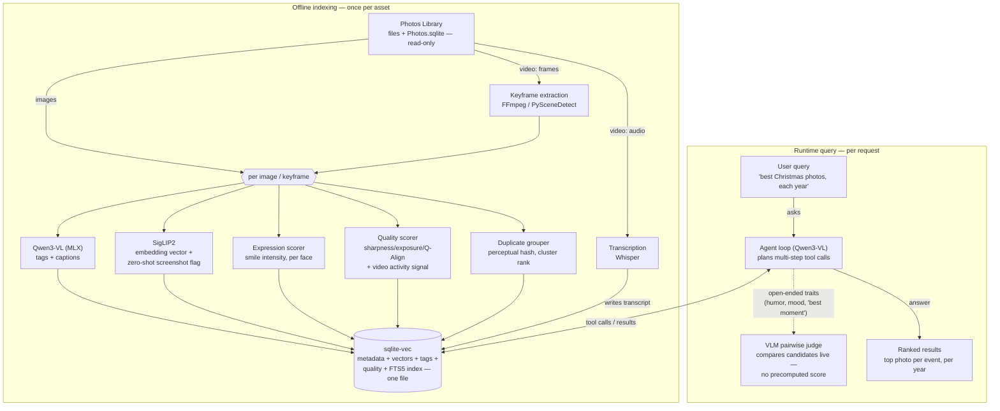

# Architecture

> A styled, interactive version of this diagram is also in this repo: [`architecture.html`](architecture.html) — open it directly in a browser, or enable GitHub Pages on this repo to view it hosted.

Two phases share one store. An offline pipeline indexes the library once per photo, keyframe, or video, entirely on-device. A runtime agent answers natural-language queries by calling back into that same index.

## Indexing — offline, once per asset

| Component | What it does |
|---|---|
| **Photos Library** | Source of truth. Read-only access to the original files plus `Photos.sqlite` metadata — dates, existing keywords, and Apple's own on-device face clustering (`ZPERSON`/`ZDETECTEDFACE`). Named clusters flow straight into the index; unnamed ones are best named in Photos.app itself using Apple's native People UI, not rebuilt here (see [ADR-0015](adr/0015-people-via-photos-native-clustering.md)). Never written to. |
| **Keyframe extraction** | Scene-change detection (FFmpeg or PySceneDetect) picks one representative frame per video shot. Images skip this step entirely. |
| **Qwen3-VL (MLX)** | 30B-A3B mixture-of-experts vision-language model, ~18GB resident at 4-bit quant. Generates tags and free-text captions per image/keyframe. |
| **SigLIP2** | Cross-modal embedding model. Turns each image/keyframe into a vector for meaning-based search. The same embedding also gives a near-free zero-shot screenshot/document flag (compare against label prompts like "screenshot," no extra model), and powers few-shot pet identification — matching against a handful of user-labeled reference photos per pet, since no mature dedicated pet-ID model exists yet (see [ADR-0016](adr/0016-pet-identification-few-shot-siglip2.md)). Lower confidence than person recognition; suggestion-only. |
| **Expression scorer** | A cheap classical face-expression model (py-feat/DeepFace-style), run per detected face, scoring smile intensity and visible happiness. Reliable for this one recurring axis — not for open-ended traits like "silly" (see VLM pairwise judge). |
| **Quality scorer** | Sharpness/exposure scoring plus Q-Align for aesthetic and video quality. For video, also folds in a cheap activity signal (motion variance, scene-change count, transcript density) as a candidate "might be boring" flag — never a verdict on its own. |
| **Duplicate grouper** | Perceptual hashing clusters near-identical shots taken in succession. Surfaces a *suggested* best-in-group; picking and deleting stays manual. |
| **Transcription** | Whisper, run locally on each video's audio track. Writes a timestamped transcript straight into the store — search over what was said, not just what's visible. |
| **sqlite-vec** | One SQLite file holding metadata, vectors, tags, quality/duplicate/transcript data, and an FTS5 full-text index — no second storage system to run. |

## Query — runtime, per request

| Component | What it does |
|---|---|
| **User query** | Natural language, e.g. "show me the best Christmas pictures from each year." No query syntax to learn. |
| **Agent loop (Qwen3-VL)** | A local tool-calling model that decomposes a query into steps — search per year, rank each year's results, compose an answer — and can retry a bad step. Reuses the same vision-capable model as tagging/judging rather than loading a second model just for text reasoning. |
| **Tools** | `semantic_search(query, filters)` — hybrid: FTS5 keyword hits and SigLIP2 vector hits combined by Reciprocal Rank Fusion — plus `get_photo_metadata(id)` and `rank_by_quality(ids)`. All three read the same store built during indexing. |
| **VLM pairwise judge** | For traits with no stable per-photo score — humor, "best moment," mood — the agent skips the store and asks the model to compare candidates directly, pairwise, over just the narrowed set. Never an absolute score: pairwise LLM judgments hold up far better than absolute ones. |
| **Ranked results** | The agent's final answer — e.g. one best photo per year — ordered by the quality scorer, not just relevance. |

## Operating model

Two loops, not one continuously-running system — this needs to stay current indefinitely as new photos and videos get added, which is a different problem from "run once."

1. A cheap **watcher** (`launchd`, no AI involved) checks `Photos.sqlite` on a schedule for anything newer than the last-indexed watermark.
2. Once enough new assets accumulate, a **batch indexing job** loads the models above, processes the batch, and releases the memory — rather than reloading an 18GB model per photo.
3. The **query/agent side loads on demand**, when a question is actually asked, not kept resident all day.

See [ADR-0013](adr/0013-operational-model-two-loops.md).

## Why no graph database

Cross-connector relationship queries ("photos of people mentioned in this email thread") are a real future need, but a dedicated graph database solves a scale problem this project doesn't have — a personal archive is thousands of entities, not billions. Relationships are modeled as a plain edges table in the same SQLite store; an embedded graph engine (e.g. Kuzu) is the escape hatch if that ever genuinely proves insufficient, not a server-based graph database. See [ADR-0011](adr/0011-no-graph-database.md).

## Open questions

Things that are genuinely unresolved, not decisions dressed up as questions — tracked here rather than as ADRs because there's no decision to record yet, only something to measure or design once real building starts.

- **Compute-time budget.** No one has measured how long a full first pass over ~150K photos + ~500GB of video will actually take on the Mac Studio. This matters for whether the watcher/batch-job model (ADR-0013) needs any prioritization or chunking of the initial backlog versus just running to completion.
- **UI.** Nothing has been designed yet — not even sketched — beyond a passing reference to reusing the prior dedup project's dashboard pattern. This is the single largest undesigned piece of the whole system; tracked in the README roadmap, deliberately left until the rest of the pipeline exists to build a UI on top of.

## Decision record

Every non-obvious choice above has a corresponding ADR in [adr/](adr/) (start with the [index](adr/README.md)), including the alternatives considered and why they were passed over.
